# Hello_Objective-C
Let's study Objective-C


> First Project

1. Objective-C 특성
	- main() `@autoreleasepool` 안에서 코드를 작성해야 한다.
	-  Objective-C는 정의부와 구현부로 나뉘는데 다음과 같다.
	
		```Objective-C
		@interface Vehicle : NSObject { // 정의부
			// member variable
		}
		//member method
		@end
		
		@implementation Vehicle // 구현부
		
		@end
		
		int main() {
		
		}
		```

2. Object 분류
	- Object는 Class Object와 Instance Object로 나뉘어진다.
	
		1) Class Object
		
		- Class는 `member variable`영역과 `member method`영역으로 나뉘어진다.
		- member variable은 정의부 중괄호 안에, member method는 밖에 코드를 작성한다.
		- member variable은 초기화를 할 수 없다.(default 0으로 정의됨)
		- member method는 정의부에 정의 후에 구현부에  중괄호를 열어 작성한다.
		- `-`: 인스턴스 메소드(동적할당을 해서 인스턴스를 만들어야 쓸 수 있음) / `+`: 클래스 메소드(동적할당을 하지 않아도 쓸 수 있음)
			
		2) NSObject
		
		- 모든 Class들은 최상위 클래스인 NSObject를 상속받게 된다.
		- new & alloc & init
			- new
				-  instance화 된 클래스 생성(메모리 heap 영역에 동적할당 하게 됨)
				-  alloc과 init을 합쳐놓은 것
			- alloc
				- 클래스 메소드
				- 새로운 인스턴스를 리턴해줌
			- init
				- 인스턴스 메소드
				- 메모리에 할당된 후 즉시 새로운 Object를 초기화 해서 구현하는 부분

3. Property & Synthesize
	- getter, setter을 대신하여 쓸 수 있는 것이 Property와 Synthesize이다.
	- 다음과 같이 정의부에 Property를, 구현부에 Synthesize를 쓸 수 있다.
	
		```Objective-C
		@property int wheels; // 정의부
		@property int seats;
		
		@synthesize wheels; // 구현부
		@synthesize seats;
		```
4. Property Option & Dot operator
	- 프로퍼티명을 바꾸고 싶을 때는 다음과 같이 바꿀 수 있다.

		```Objective-C
		// @property int wheels;
		@property (getter=getWheels, setter=wheels:) int wheels;
		```
		
	- `.` 연산자를 사용할 수 있다.
	
		```Objective-C
		// [hello setWheels: 4];
		hello.setWheels = 4;
		```
		
	- 메소드에서 여러개의 프로퍼티를 받고 싶을 때는 다음과 같이 쓸 수 있다.
	
		```Objective-C
		-(void)setWheels: (int)w Seats: (int)s; // 정의부
		-(void)setWheels: (int)w Seats: (int)s {  // 구현부
		    wheels = w;
		    seats = s;
		}
		[hello setWheels:4 Seats:2]; // 사용 시
		```
		
5. 조건문(if-else, switch)
	-  조건문은 다른 언어와 동일하다.
	
		```Objective-C
		if(hello.wheels == 4) {
			NSLog(@"wheels : 4");
		}else {
			NSLog(@"no");
		}
		```
    
		```Objective-C
		switch (hello.seats) {
			case 4:
				NSLog(@"wheels : 4");
				break;
			case 2:
				NSLog(@"wheels : 2");
				break;
			default:
				NSLog(@"no");
				break;
		}
		```

6. 반복문(for, while)
	- 반복문도 다른 언어와 동일하다.
	
		```Objective-C
		for(int i=0;i<hello.wheels;i++) {
			NSLog(@"wheels no %i", i);
		}
		int i=0;
		while(i<hello.seats) {
			NSLog(@"seats no %i", i);
			i++;
		}
		``` 


> NSString

1. NSString 초기화 방법
	- 다음 3가지 방법은 모두 동일한 결과를 보인다. 메모리 동적할당과 동시에 값을 초기화 하게 됨.

	```Objective-C
	NSString *str = [[NSString alloc]init];
	str = @"This is NSString";
	
	NSString *str2 = [[NSString alloc]initWithString: @"This is NSString2"]; // convenience method
	
	NSString *str3 = @"This is NSString2";
	```
	
2. NSString 클래스 메서드
	- substringFromIndex: 해당 인덱스부터 끝까지 String을 잘라서 새로 만들고 리턴함.

		```Objective-C
		NSString *result = [str substringFromIndex:6];
		NSLog(@"str : %@", result); // s NSString2
		```
		
	- substringToIndex: 앞에서부터 해당 인덱스까지 String 잘라서 새로 만들고 리턴함.
	
		```Objective-C	        
		NSString *result2 = [str substringToIndex:3];
		NSLog(@"str : %@", result2); // Thi
		```
		
	-  substringWithRange: NSMakeRange(index, length): 해당 범위 만큼 자름
	
		```Objective-C
		NSString *result3 = [[str substringToIndex:11]substringFromIndex:8];
    	NSLog(@"str : %@", result3); // NSS
	        
        NSString *result4 = [str substringWithRange:NSMakeRange(8, 3)];
        NSLog(@"str : %@", result4); // NSS
		```
		
	- upper, lower
	
		 ```Objective-C
		 NSString *result5 = [[str substringWithRange:NSMakeRange(8, 3)] uppercaseString];
        NSLog(@"str : %@", result5); // NSS
        result5 = [[str substringWithRange:NSMakeRange(8, 3)] lowercaseString];
        NSLog(@"str : %@", result5); // nss
		 ```
		
> NSMutableString

- 문자열 자기 자신이 변화되는 String
- 문자열을 중간에 삽입하거나, 뒤에 추가 할 수 있다.

	```Objective-C
	NSMutableString *mstr = [NSMutableString stringWithString: str];
	[mstr appendString: @" and NSMutableString"];
	[mstr insertString: @"Mutable " atIndex: 8];
	NSLog(@"mstr : %@", mstr);
	```
	
> NSArray

- 순서가 있는 객체들을 관리
-  정적인 배열로 NSMutableArray보다 속도가 빠름
- 끝나는 부분에 nil을 표시해야함.

	```Objective-C
	NSArray *month = [[NSArray alloc]initWithObjects:@"January", @"February", @"March", @"April", @"June", @"July", @"Auguest", @"September", nil];
	```
	
	```Objective-C
	for (int i=0;i<[month count];i++){
		NSLog(@"month : %@", [month objectAtIndex:i]);
	}
	for (NSString *strTemp in month){
		NSLog(@"month : %@", strTemp);
	}
	```
	
> NSMutableArray

- 추가, 삭제, 수정이 가능한 Array

	```Objective-C
	NSMutableArray *mmonth = [NSMutableArray arrayWithArray: month];
        
	[mmonth addObject: @"October"];
	[mmonth addObject: @"November"];
	[mmonth addObject: @"December"];
	    
	for(NSString *strTemp in mmonth) {
	    NSLog(@"month : %@", strTemp);
	}
	```
	
> NSDictionary

-  key-value 형식으로 된 자료구조
-  initWithObjectsAndKeys 메소드를 이용해 key-value를 넣어줌
-  objectForKey를 이용해 key값으로 value를 출력할 수 있다.

	```Objective-C
	NSDictionary *dic = [[NSDictionary alloc] initWithObjectsAndKeys: @"최강사", @"이름", @"모름", @"나이", nil];
	NSLog(@"name: %@", [dic objectForKey: @"이름"]);
	NSLog(@"age: %@", [dic objectForKey: @"나이"]);
	```
	
> NSMutableDictionary

- 추가, 삭제, 수정이 가능한 Dictionary

	```Objective-C
	NSMutableDictionary *mdic = [NSMutableDictionary dictionaryWithDictionary: dic];
	[mdic setObject: @"한국" forKey: @"사는곳"];
	[mdic setObject: @"약간검정" forKey: @"얼굴색"];
	    
	NSLog(@"name: %@", [mdic objectForKey: @"이름"]);
	NSLog(@"age: %@", [mdic objectForKey: @"나이"]);
	NSLog(@"location: %@", [mdic objectForKey: @"사는곳"]);
	NSLog(@"face color: %@", [mdic objectForKey: @"얼굴색"]);
	```
	
> Project BookManager (console)

- 도서 관리 프로그램 (책 추가, 검색, 삭제 기능)

	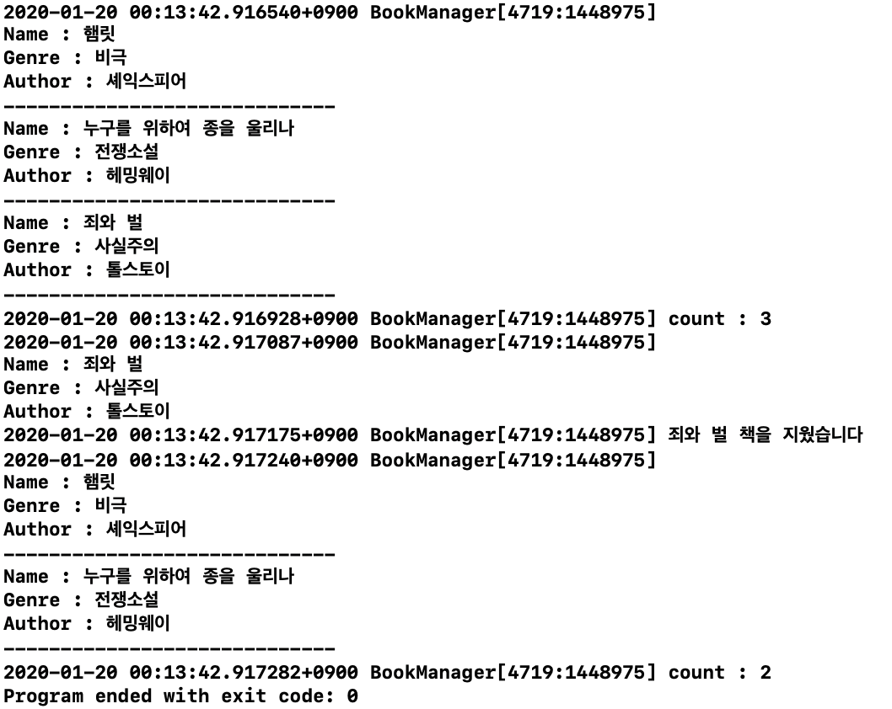
	
> Project VisualAddressBook

- 도서 관리 프로그램 (책 추가, 전체 보기)

	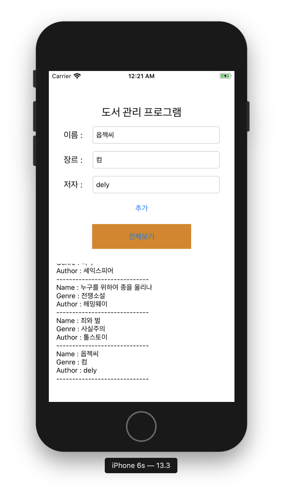
	
	- 추가, 검색

	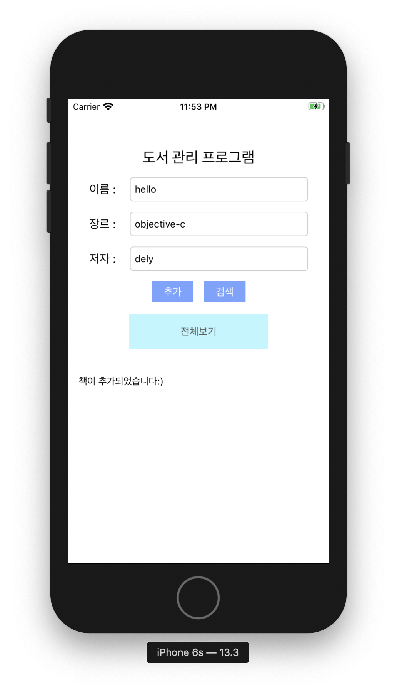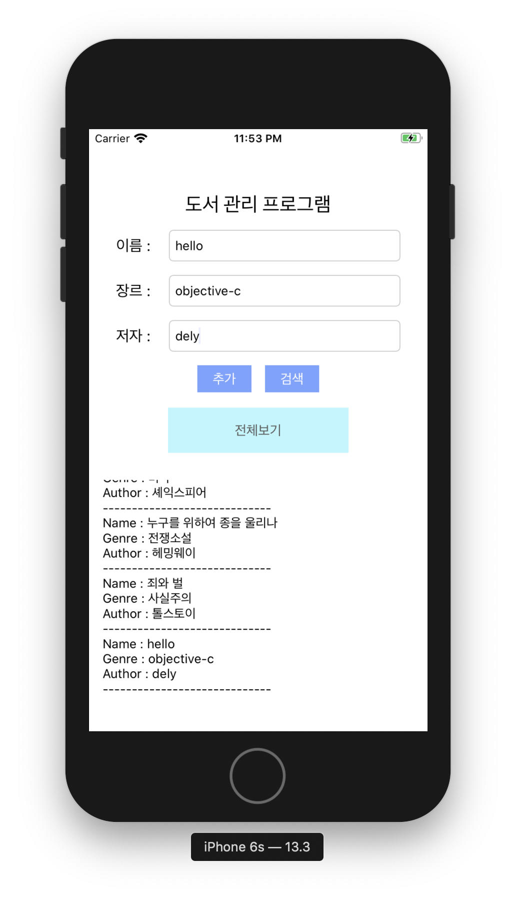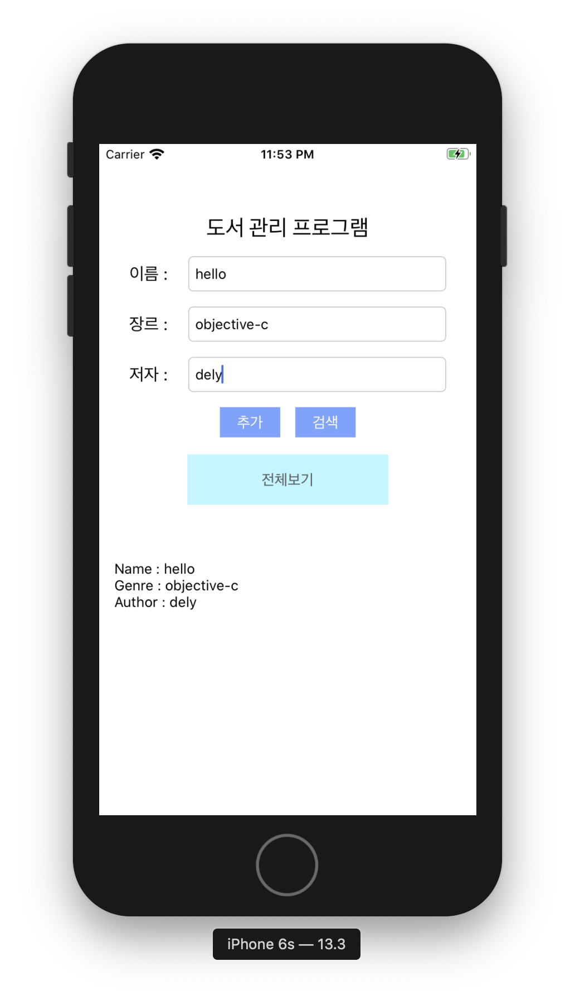
	
	- 삭제
	
	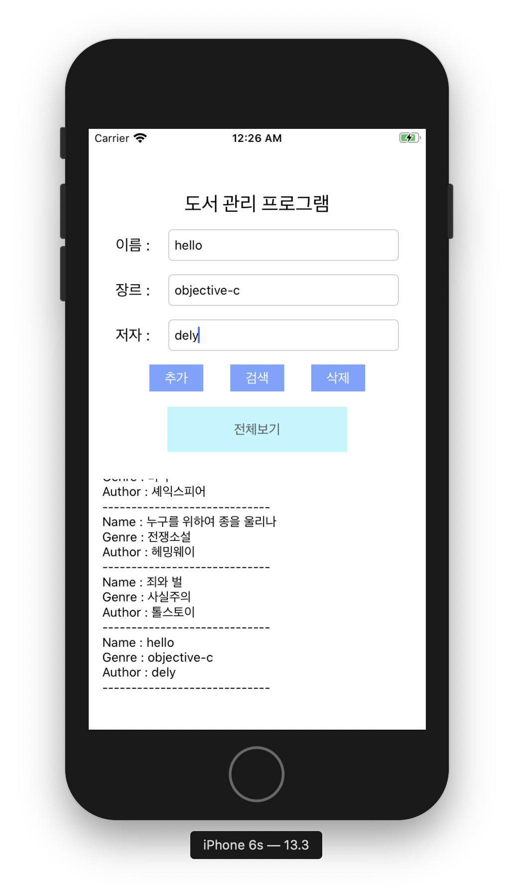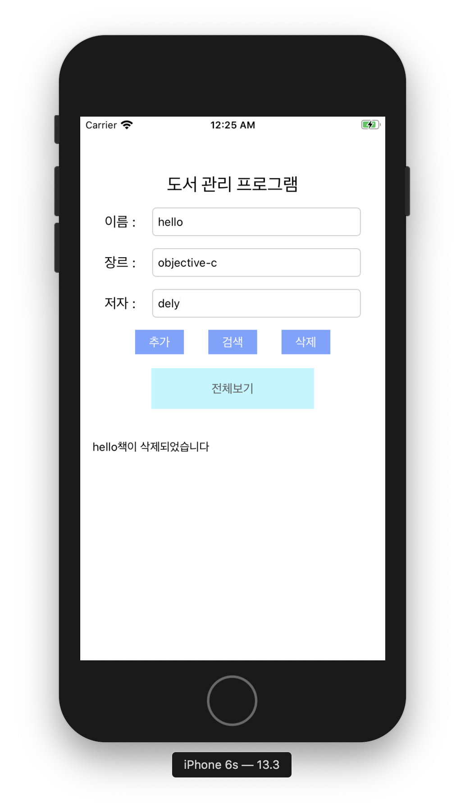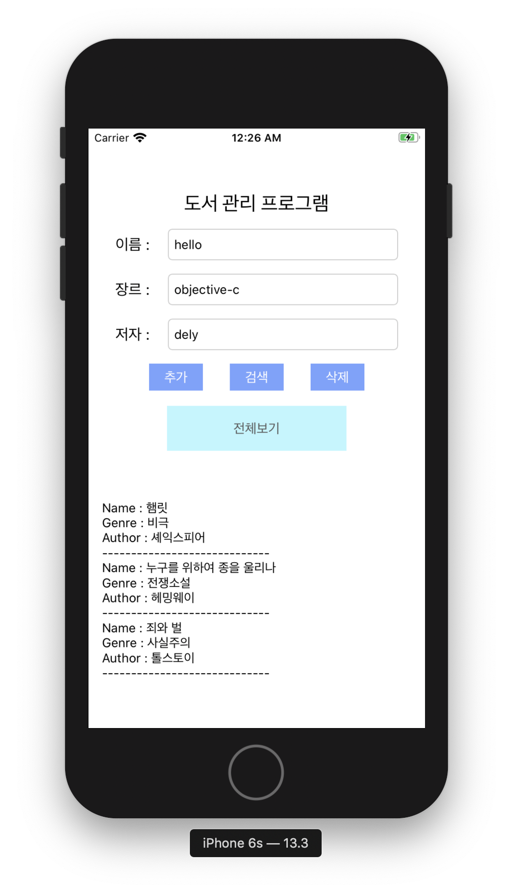
	
	- 전체도서 개수 출력
	
	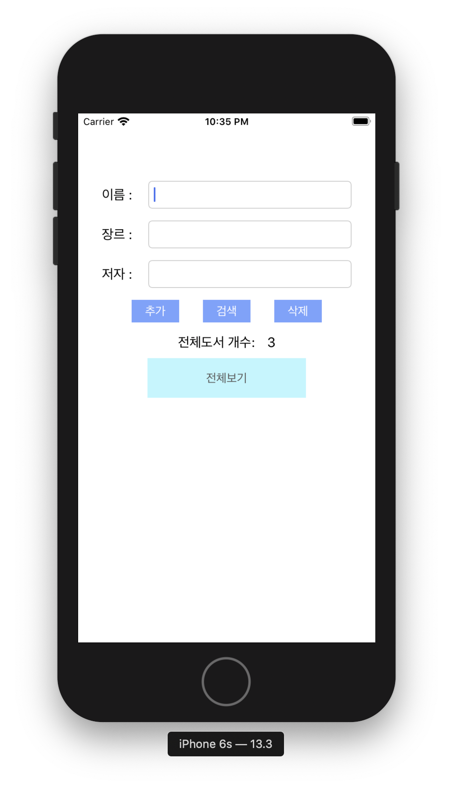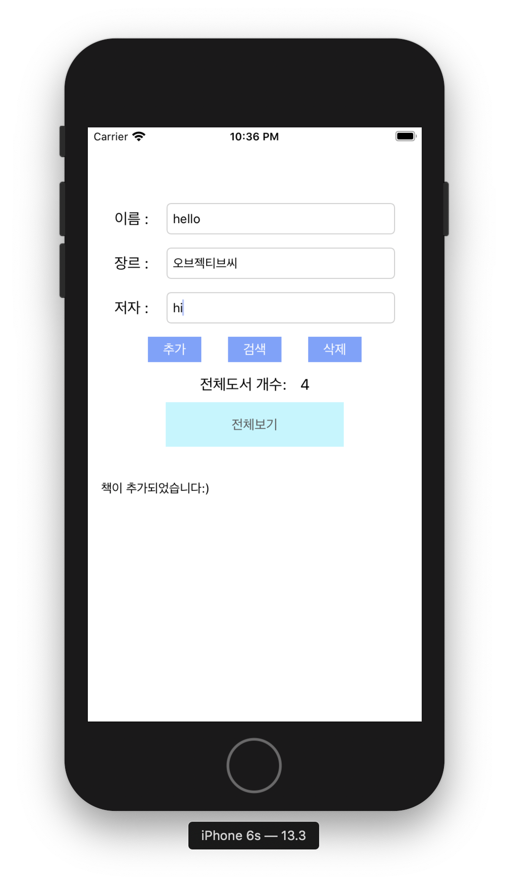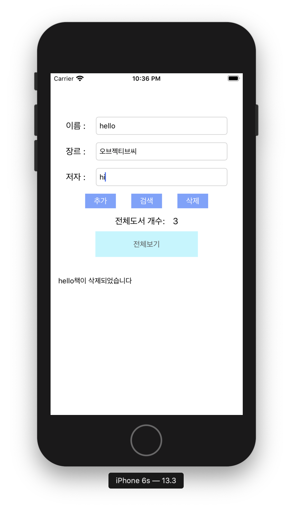
	

> Project DigitalFrame
 
- 디지털 앨범 (오토 애니메이션)

	
	
> Project SignUpScreen

- 프로토콜(Protocols)
	- 자바 interface와 유사한 기능으로 이를 상속받는 클래스에서 기능을 구현함.
	- 아래와 같은 형식으로 사용할 수 있음
	
	```Objective-C
	@protocol
	...
	@optional //구현하지 않아도 됨
	@required //필수로 구현
	...
	@end
	```
	
- 딜리게이트(delegate)
	- 특정한 기능이 실행될 때 delegate method가 호출되게 됨
	- placeholder, password secure text, number keypad, blog keypad 설정

	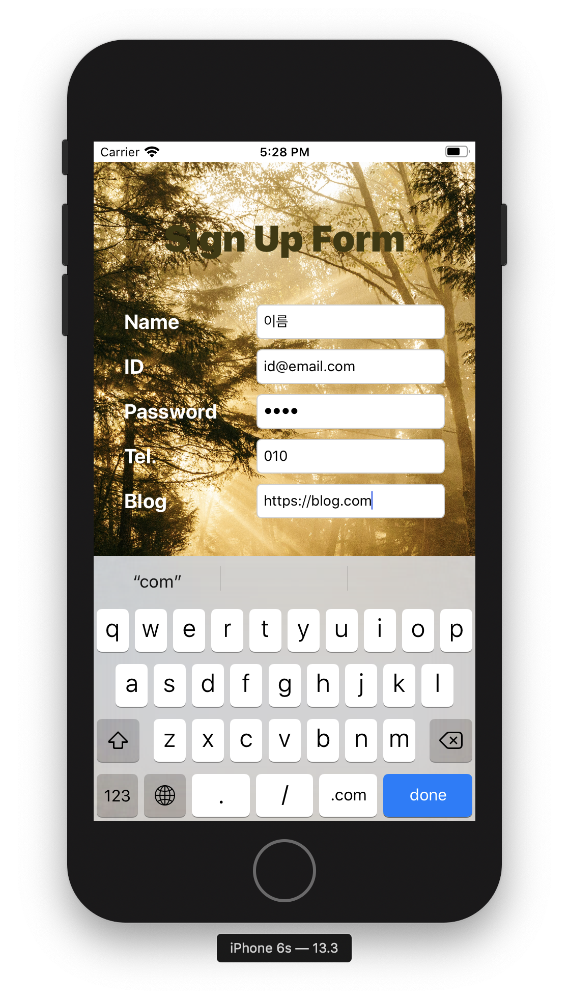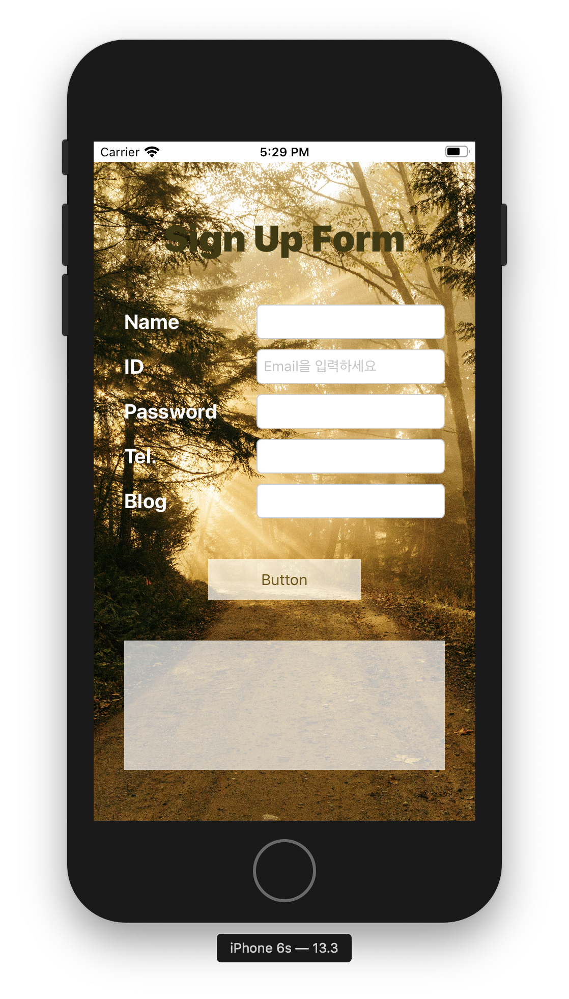
	
	- Responder Chain : 하위의 View에서 처리가 되지 않은 이벤트를 상위 View에서 차례대로 올라가면서 넘어가게 됨.(누군가가 처리하면 이벤트가 날아가게 됨) - 이벤트 버블링(웹)